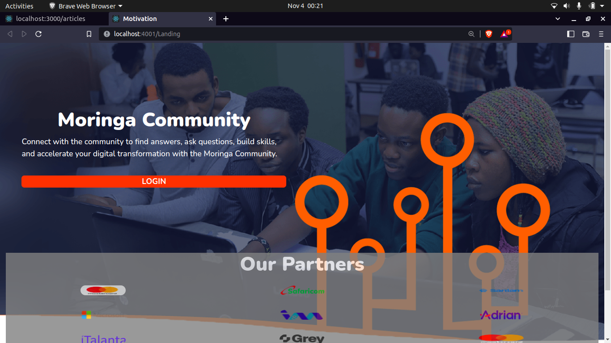
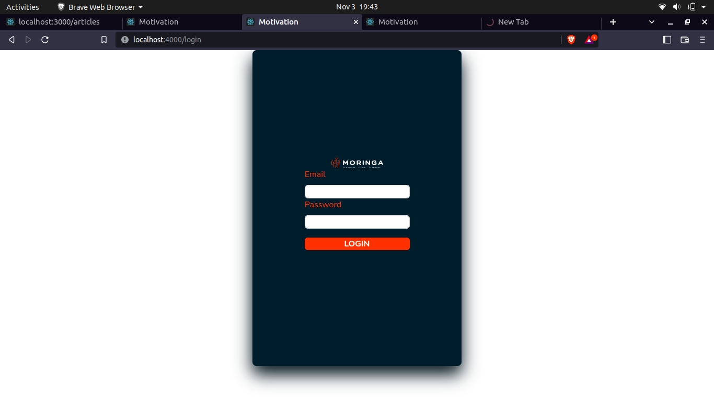
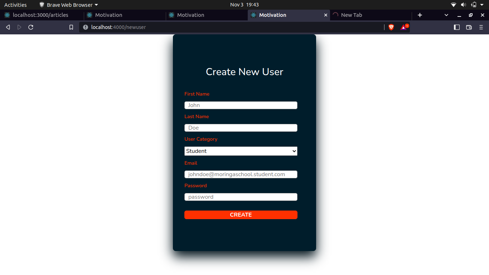

# **[Motivation-App](https://github.com/Oscarachieng/motivation-app)**:kenya:

## **Authors** :black_nib:


   [Kelvin Kariuki](https://github.com/Kelvin-kariuki)<br>
   [Livya Kendi](https://github.com/livya-kendi)<br>
   [Oscar Ochieng](https://github.com/Oscarachieng)<br>
   [Peter Atito](https://github.com/peterclermy232)<br>
   [Newton Mboi](https://github.com/devblackie)<br>
   [Samuel Mwaura](https://github.com/samuelmwaura)<br>

---

## Project Description

There is dire need to keep the Moringa School Community motivated during and after the bootcamp. <br> With the intensity of the software development program, it can be easy to burn out or even give up along the way. <br> Hence the need for a **motivation app** to reach the entire community.

---
### Links To Slides & Figma Design

[Link to slides](https://www.canva.com/design/DAFQqzfrCdg/m_HPRjgSnajJakWdqb4IFw/view?utm_content=DA[#4)<br>

[Figma Design](https://www.figma.com/file/d9Ry7aNnWv08VMFdQSCdYC/Untitled?node-id=0%3A1)<br>


---

## Screen shots :fire:

### Landing Page


### Login Page



### Home Page
<br>

### Staff Page
<br>

### Student Page
<br>

### Admin Page
<br>

### Creating User Form

### Creating Category Form
<br>

### Edit User Form
<br>

---
## Table of content

- [Technologies](#technologies)
- [Description](#description)
- [Features](#features)
- [Setup-process](#setup_process)
- [Project-usage](#project-usage)
- [Licence](#licence)
- [Copyright](#copyright)

---

## Technologies :gear:


    Ruby on Rails

    HTML and CSS

    JavaScript (React)

    PostgreSQL

    Heroku (deployment)

    Git and GitHub (version control)

    Redux

    Bootstrap

---

### Features :green_circle:

1. The application allows a user to post articles/blogs/videos and audios that will motivate members in the community.

2. The application gives users access to other people posts/comments/reactions and shares.

3. The applications allows a staff to verify/flag posted content.

4. The application allows a staff options to create categories.

5. The application gives the administrator an option to Create, Edit and Delete a user.

### Description

Motivation app is a great plateform that allows members of the community to share and post videos/images or audios that motivate other members in the community.<br>

Members have the access to the application and participate in posting motivating information, It will enhance massive participation.

### Requirements

The following are the requirements to start and run this project.

    Ruby 2.7.4 or later versions.

    Rails 5.0 or later versions.

    PostgreSQL 9.5 or later versions.

    npm

    node

    Material ui version 4

    Bootstrap 5

    Heroku

### Dependancies :link:
* rails <br>
*  ruby <br>
*  node <br>
*  npm <br>
*  Material UI <br>
*  Bootstrap <br>

### Setup :hammer_and_wrench:

---

#### Client (React)

clone the repo using the command

```terminal
>>Git Link
```

change directory using command

```terminal
cd Motivation-App
```

open project in vscode texteditor

```terminal
code .
```

install dependancies

```shell
npm install
```

run client end

```terminal
npm run dev
```

---

#### API (Ruby on Rails)

clone the repo using the command

```terminal
>> Git Link
```

change directory using command

```terminal
cd Motivation-app
```

open project in vscode texteditor

```terminal
code .
```

Check your Ruby version

```terminal
ruby -v
```

The ouput should start with something like `ruby 2.7.4` or any later version currently installed.

If not, install the right ruby version using [rbenv](https://github.com/rbenv/rbenv) (it could take a while):

```terminal
rbenv install 2.7.0
```

install dependancies packages

```terminal
bundle install
```

Initialize the database

```terminal
rails db:create db:migrate db:seed
```

run api server

```terminal
rails s
```

---
## How to use the project

- To use the project follow the steps below:

- First Login to the application. 

- Add a post.

- View all posts.

- Share Posts.

---


### Contributing to project :memo: 

    - Fork the repo

    * Create a new branch in your terminal (git checkout -b improve-feature)
    * Install the prerequisites
    * Make appropriate changes in file(s)
    * Run the server to see the changes
    * Add the changes and commit them (git commit -am "Improve App")
    * Push to the branch (git push origin improve-app)
    * Create a Pull request

---

## Copyright :lock:

**This project is licensed under the MIT License - see the LICENSE.md file for details.**

---

## [License](LICENSE) :shield:

MIT License
Copyright (c) 2022

